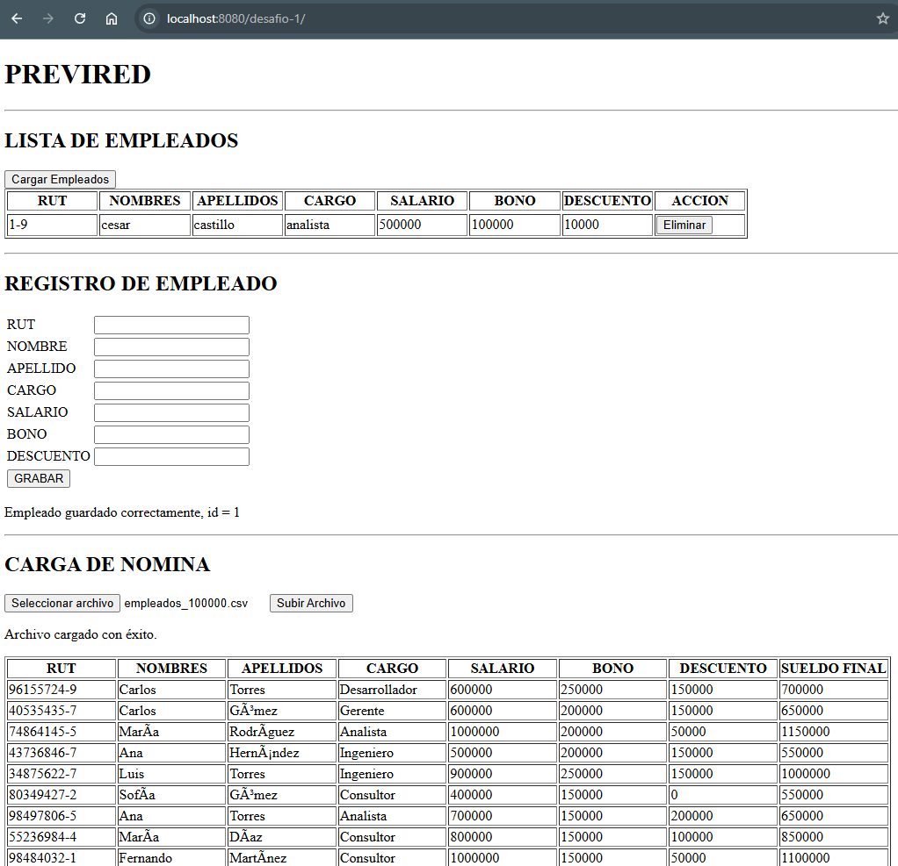
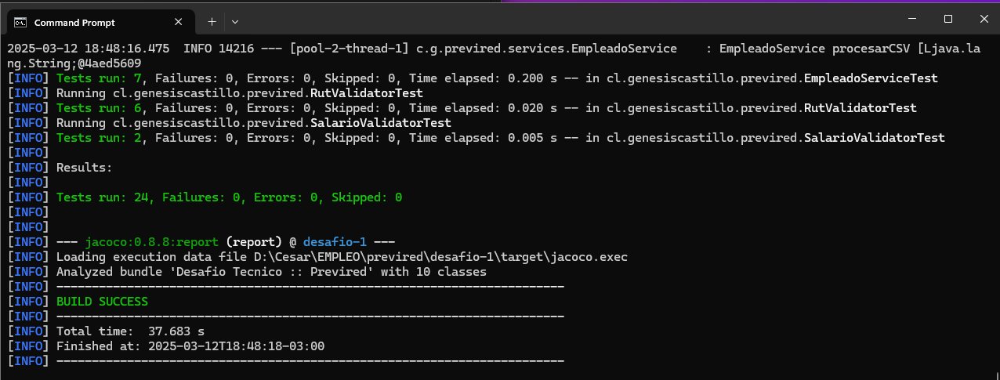
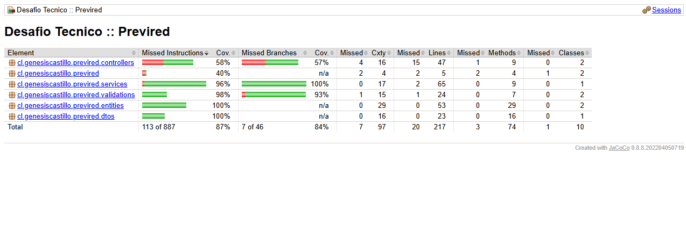

## 📌 **README.md** - Aplicación PREVIRED

```md
# 🌟 PREVIRED (WAR)

Este proyecto es una aplicación **Spring Boot** empaquetada como **WAR** para desplegar en **Apache Tomcat**.

## 🚀 Características

✅ Spring Boot con soporte para empaquetado WAR  
✅ Controladores REST y vistas con HTML con AJAX de JQuery 
✅ Configuración para desplegar en Tomcat  
✅ Base de datos H2 para pruebas  

---

## 📂 **Estructura del Proyecto**
```sh
desafio-1/
│   pom.xml
│   README.md
│
├───data
│       01 README.md
│       02 Instrucciones del ejercicio-1.md
│       empleados_100000.csv
│       empleados_100002.csv
│       index.png
│       mvntest.png
│       pruebaunitaria.png
│
└───src
    ├───main
    │   ├───java
    │   │   └───cl
    │   │       └───genesiscastillo
    │   │           └───previred
    │   │               │   Application.java
    │   │               │   ServletInitializer.java
    │   │               │
    │   │               ├───controllers
    │   │               │       EmpleadoController.java
    │   │               │       IndexController.java
    │   │               │
    │   │               ├───dtos
    │   │               │       EmpleadoDTO.java
    │   │               │
    │   │               ├───entities
    │   │               │       Empleado.java
    │   │               │
    │   │               ├───repositories
    │   │               │       EmpleadoRepository.java
    │   │               │
    │   │               ├───services
    │   │               │       EmpleadoService.java
    │   │               │
    │   │               └───validations
    │   │                       RutValidator.java
    │   │                       SalarioValidator.java
    │   │                       ValidaSalario.java
    │   │                       ValidRut.java
    │   │
    │   ├───resources
    │   │   │   application.properties
    │   │   │
    │   │   └───templates
    │   │           index.html
    │   │
    │   └───webapp
    └───test
        └───java
            └───cl
                └───genesiscastillo
                    └───previred
                            ApplicationTest.java
                            EmpleadoControllerTest.java
                            EmpleadoServiceTest.java
                            RutValidatorTest.java
                            SalarioValidatorTest.java


```

---

## 🔧 **Configuración y Ejecución**

### 📦 **1. Clonar el repositorio**
```sh
git clone https://github.com/genesiscastillo75/desafio-1.git
cd desafio-1
```

---

### ⚙️ **2. Configurar el entorno**
Edita `src/main/resources/application.properties` si necesitas modificar la configuración.

### 🛠️ **3. Construir el WAR**
```sh
mvn clean package
```

El WAR generado estará en `target/desafio-1.war`.

### 🚀 **4. Desplegar en Tomcat**
1. Copia el archivo `.war` en la carpeta de despliegue de Tomcat:
   ```sh
   cp target/desafio-1.war /apache-tomcat-8.5.100/webapps
   ```
2. Inicia Tomcat:
   ```sh
   ./catalina.sh run  # Linux/macOS
   catalina.bat run  # Windows
   ```
3. Abre en el navegador:
   ```
   http://localhost:8080/desafio-1/
   ```




---

## 🛠 **Tecnologías Usadas**
- **Spring Boot**  
- **Spring MVC**  
- **HTML & JQuery**  
- **JPA / Hibernate**  
- **H2 Database (para pruebas)**  
- **Maven**  
- **Tomcat**  

---

## 📜 **Endpoints REST :: Empleados**
| Método | Ruta | Descripción |
|--------|------|------------|
| `GET` | `/desafio-1/api/` | Página de inicio |
| `GET` | `/desafio-1/api/empleados/` | Obtiene una lista de empleados |
| `POST` | `/desafio-1/api/empleados/` | Crea un empleado |
| `DELETE` | `/desafio-1/api/empleados/{id}` | Elimina un usuario |


## 📜 **Endpoints REST :: Nominas**
| Método | Ruta | Descripción |
|--------|------|------------|
| `POST` | `/desafio-1/api/nominas/calcular` | Cargar un archivo csv de nomina |


Ejemplo de endpoint:
```sh
curl -X GET http://localhost:8080/desafio-1/api/empleados/
```

```json
[
    {
        "id": 1,
        "nombre": "cesar",
        "apellido": "castillo",
        "rutdni": "22312323-6",
        "cargo": "desarrollador",
        "salario": 3000000,
        "bono": 30000,
        "descuento": 3000
    }
]
```

---

### 🎯 **Pruebas Unitarias**
```sh
mvn clean test
```


### 🎯 **Cobertura de Codigo**
```sh
cd target\site\jacoco
ls -l 
12-03-2025  18:48             6.622 index.html
```
**index.html**

---

